# Tu2tor Platform - Screenshot Documentation

This document provides detailed explanations of the Tu2tor platform's key features and user interfaces through screenshots captured from the live application.

---

## 1. Landing Page & Platform Introduction

### Main Homepage
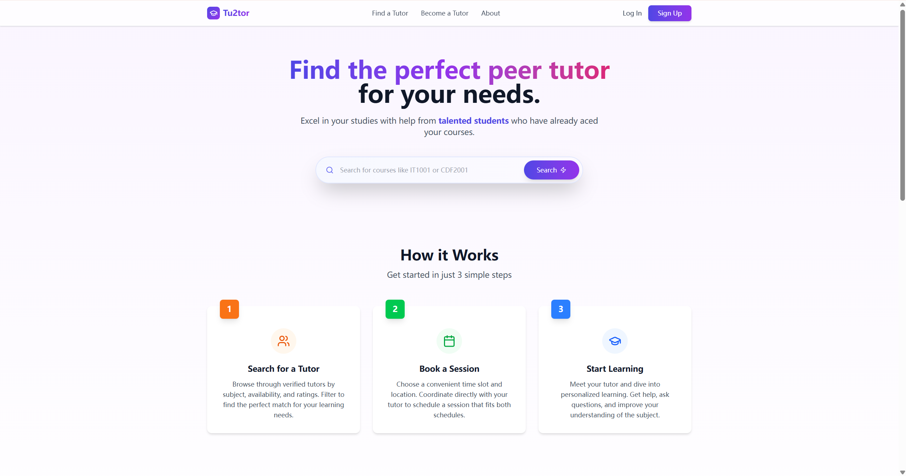

The landing page features a clean hero section with the tagline "Find the perfect peer tutor for your needs" in gradient purple typography. A search bar enables course code lookup (IT1001, CDF2001), while navigation includes "Find a Tutor," "Become a Tutor," and "About" links with "Log In" and "Sign Up" buttons.

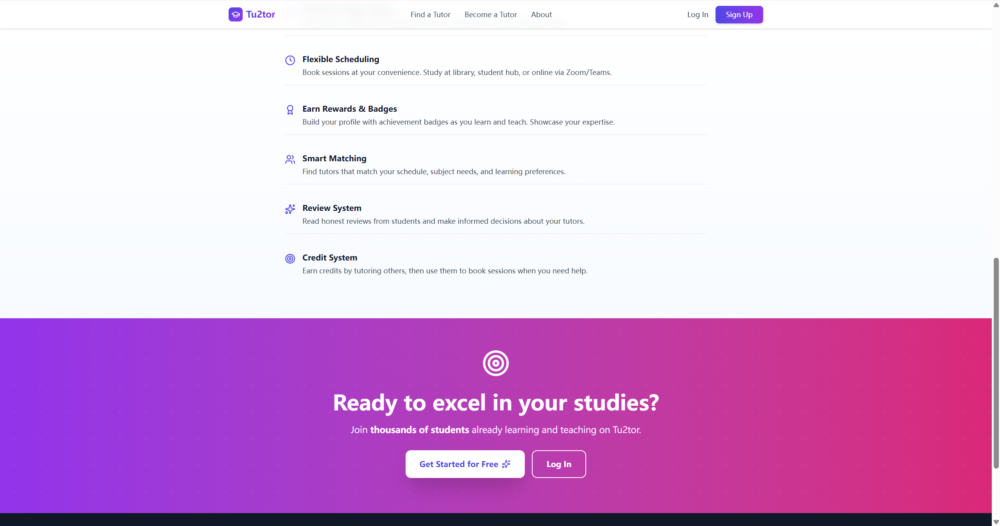

The "How it Works" section presents three steps: Search for tutors by subject/availability, Book sessions at convenient times, and Start Learning with personalized help. Key features highlighted include Flexible Scheduling, Rewards & Badges, Smart Matching, Review System, and Credit System, concluding with a "Ready to excel in your studies?" call-to-action.

---

## 2. AI Assistant - Tu2tor's Smart Helper

### AI Chat Interface
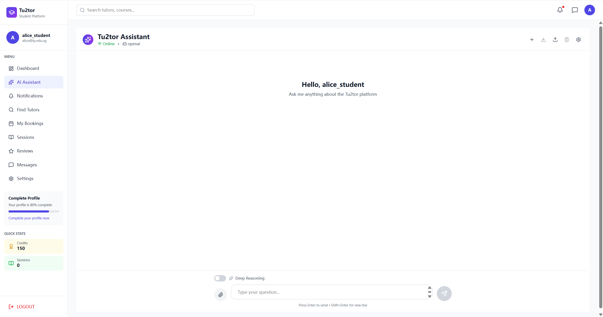

The Tu2tor Assistant is an intelligent chatbot showing "Online" status with OpenAI provider. The sidebar displays profile completion (80%), credits (150), and sessions (0). The interface greets "Hello, alice_student" with prompt "Ask me anything about the Tu2tor platform," featuring Deep Reasoning toggle and file attachment options.

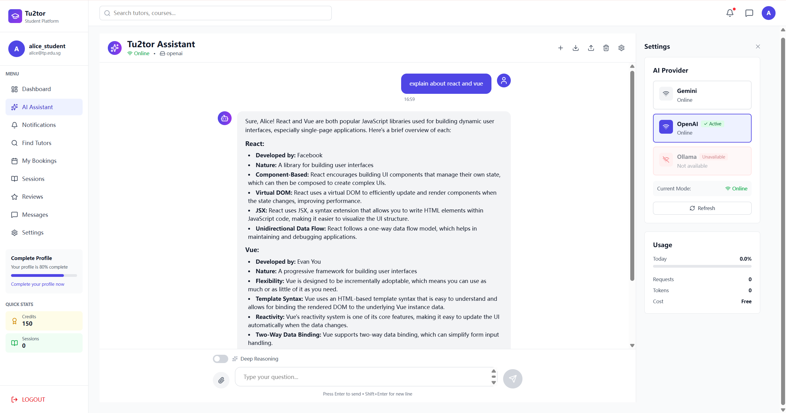

When asked "explain about react and vue," the AI provides detailed explanations covering React (Facebook, component-based, Virtual DOM, JSX) and Vue (Evan You, progressive framework, template syntax, reactivity). The Settings panel shows AI providers (Gemini, OpenAI Active, Ollama) with usage stats: 0.0% usage, 0 requests, Free tier.

---

## 3. Smart Tutor Matching with AI

### AI-Powered Recommendations
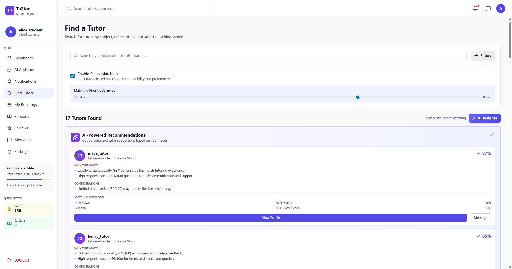

Tu2tor's AI matching system ranks tutors with "Enable Smart Matching" toggle and "Matching Priority: Balanced" slider between Schedule and Rating. Displays "17 Tutors Found" with personalized match percentages (maya_tutor 87%, henry_tutor 85%). Each recommendation shows "WHY THIS MATCH," "CONSIDERATIONS," and "MATCH DIMENSIONS" metrics including Time Match (50%), Response (93%), Rating (99%), Same School (100%).

---

## 4. Student Dashboard Overview

### Dashboard Analytics
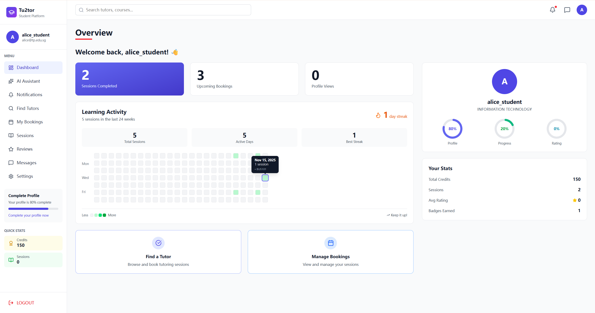

The dashboard shows alice_student's (Information Technology) key metrics: 2 Sessions Completed, 3 Upcoming Bookings, 0 Profile Views, 1-day streak. A GitHub-style heatmap tracks 5 sessions over 24 weeks. Profile completion at 80%, Quick Stats show 150 credits, 2 sessions, 0 avg rating, 1 badge. Action buttons include "Find a Tutor" and "Manage Bookings."

---

## 5. Finding and Searching Tutors

### Tutor Search Results
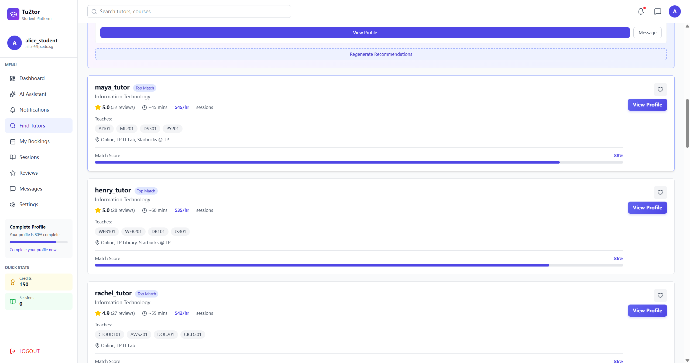

The search page displays tutors with match scores and details: maya_tutor (5.0★, 32 reviews, AI101/ML201/DS301/PY201, 88% match, $45/hr), henry_tutor (5.0★, 28 reviews, WEB101/WEB201, 86% match, $35/hr), rachel_tutor (4.9★, 27 reviews, CLOUD101/AWS201, 86% match, $42/hr). Each shows response times, sessions, locations, with "Top Match" badges and "View Profile" buttons. "Regenerate Recommendations" allows refining results.

---

## 6. Tutor Profile Details

### Complete Tutor Profile
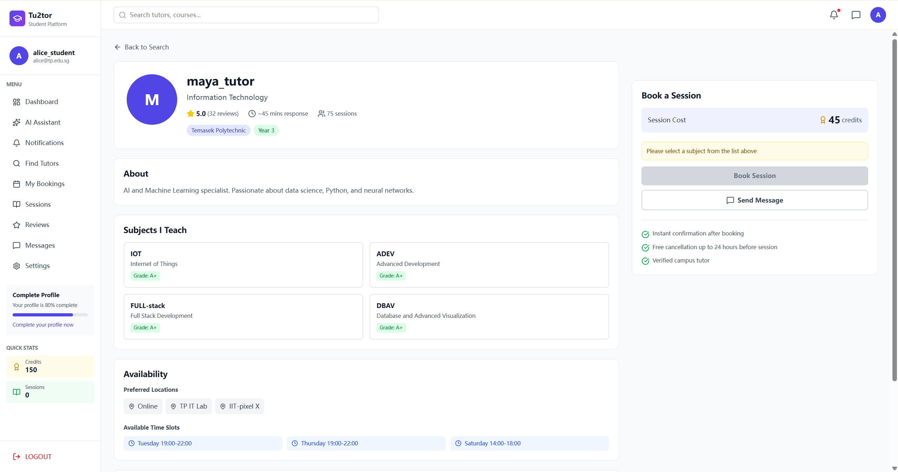

Maya_tutor's profile shows 5.0 rating (32 reviews), ~45 min response, 75 sessions, $45/hr, Temasek Polytechnic Year 3. Bio: "AI and Machine Learning specialist. Passionate about data science, Python, and neural networks." Teaches IOT, ADEV, FULL-stack, DBAV (all A+). Available Tuesday/Thursday 19:00-22:00, Saturday 14:00-18:00 at Online, TP IT Lab, IIT-pixel X. Booking sidebar shows 45 credits, instant confirmation, free 24hr cancellation, verified tutor badge.

---

## 7. Booking Management

### My Bookings Interface
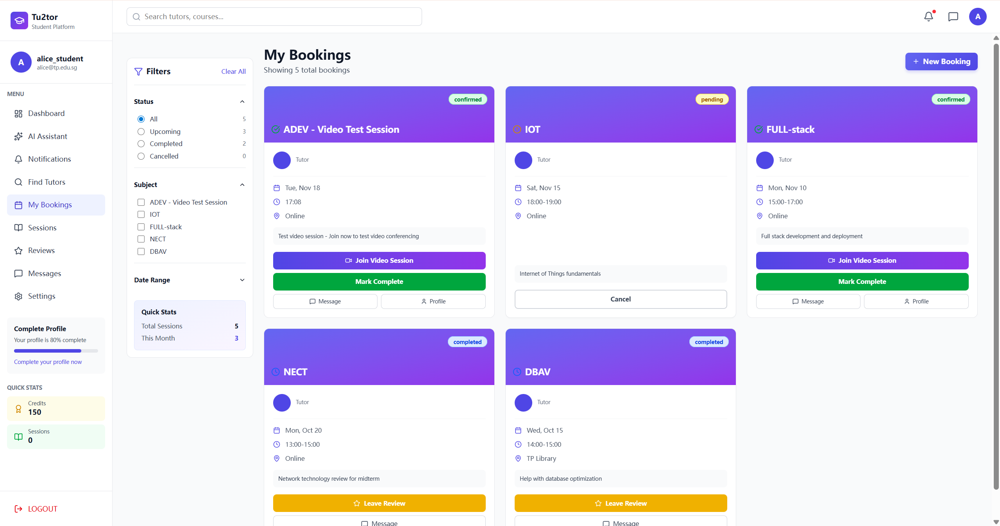

Shows alice_student's 5 bookings with Status/Subject filters. Active bookings: "ADEV - Video Test Session" (confirmed, Nov 18, Online - Join/Mark Complete), "IOT" (pending, Nov 15 - Cancel), "FULL-stack" (confirmed, Nov 10 - Join/Mark Complete). Completed: "NECT" (Oct 20), "DBAV" (Oct 15 - both with "Leave Review"). Quick Stats: 5 total sessions, 3 this month.

---

## 8. Session Management

### Active Sessions View
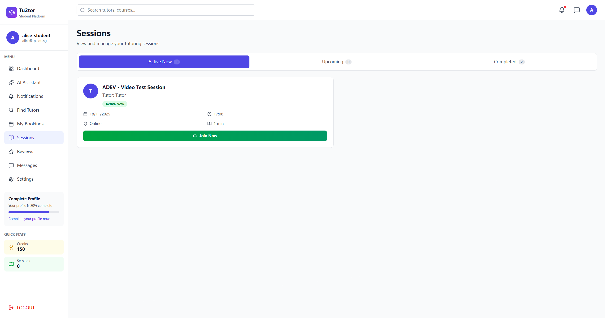

Sessions page with three tabs: "Active Now" (1), "Upcoming" (0), "Completed" (2). Active session shows "ADEV - Video Test Session" with green "Active Now" badge, date (18/11/2025), time (17:08), location (Online), duration (1 min). Prominent green "Join Now" button enables immediate video session access for time-sensitive learning.

---

## 9. Review System

### Review Management
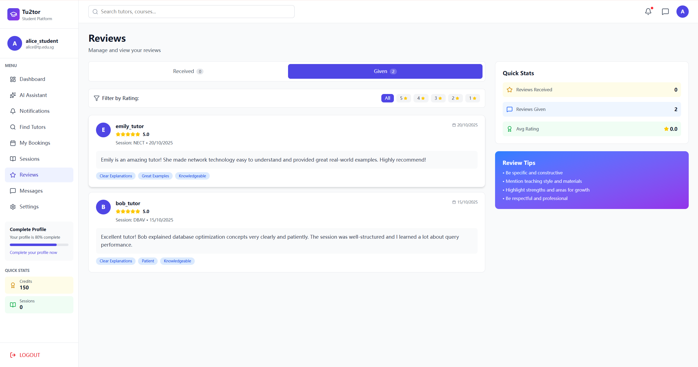

"Given" tab shows alice_student's 2 five-star reviews. emily_tutor (NECT, 20/10/2025): "Emily is an amazing tutor! She made network technology easy to understand..." (tags: Clear Explanations, Great Examples, Knowledgeable). bob_tutor (DBAV, 15/10/2025): "Excellent tutor! Bob explained database optimization concepts very clearly..." (tags: Clear Explanations, Patient, Knowledgeable). Quick Stats: 0 received, 2 given, 0.0 avg rating.

---

## 10. User Profile & Settings

### Account Settings
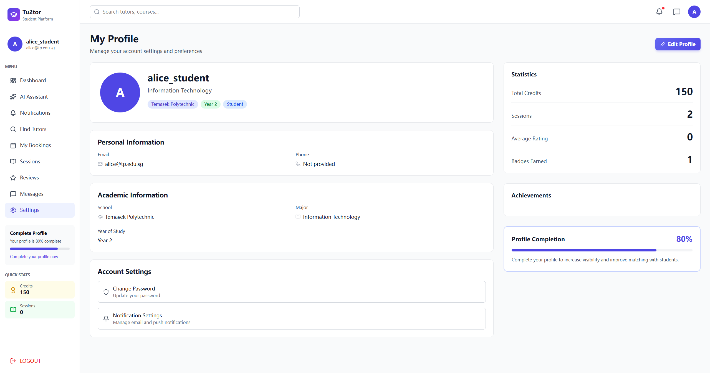

My Profile page for alice_student shows Information Technology, Temasek Polytechnic, Year 2. Personal Info: alice@tp.edu.sg, Phone: Not provided. Statistics: 150 credits, 2 sessions, 0 avg rating, 1 badge. Profile Completion: 80% with encouragement to complete for better matching. Account Settings: Change Password, Notification Settings. "Edit Profile" button enables updates.

---

## 11. Video Sessions with Collaborative Coding

### Video Conferencing Integration
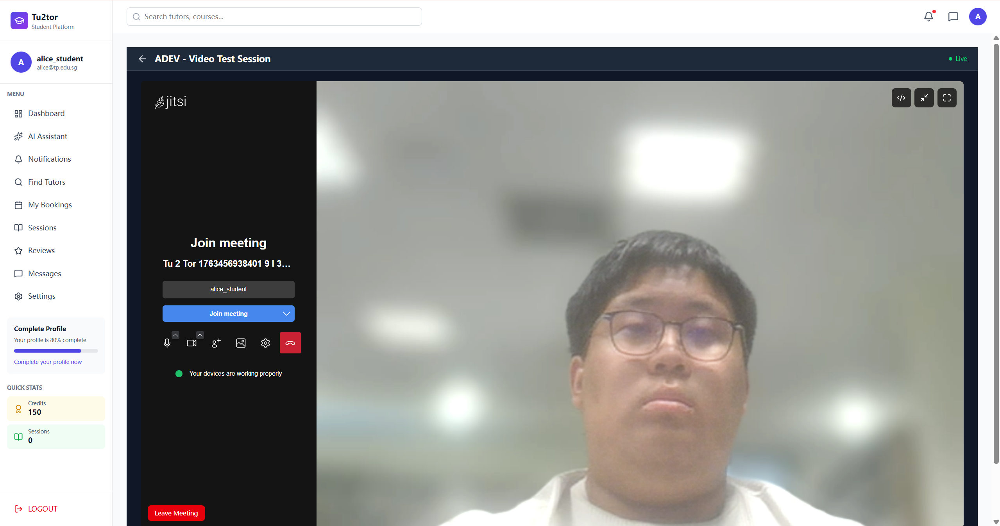

Jitsi-powered video interface for "ADEV - Video Test Session" with live feed. Sidebar shows room ID (Tu 2 Tor 1783456938401 913...) and participant (alice_student). Controls include "Join meeting," mute/unmute, video on/off, screen sharing, participants, settings, hang-up. Green indicator: "Your devices are working properly." Red "Leave Meeting" button enables easy exit.

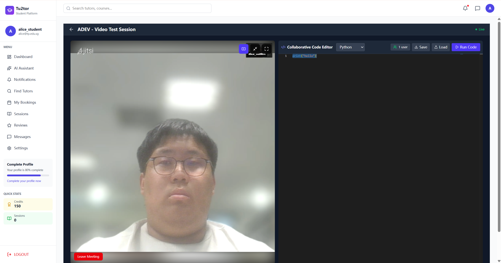

Split-screen layout: video feed (left) and "Collaborative Code Editor" (right) with Python, showing "print('hello')". Real-time status (1 user), Save, Load, "Run Code" buttons in purple. Enables simultaneous video discussion and code execution for programming courses (ADEV, FULL-stack, DBAV, IOT). Dark-themed professional development environment integrated within tutoring session.

---

## Technical Implementation Highlights

All screenshots demonstrate the MERN stack implementation with:
- **React.js**: Component-based UI with smooth navigation and state management
- **MongoDB**: Data persistence for users, bookings, reviews, and sessions
- **Express.js & Node.js**: RESTful API backend handling authentication and business logic
- **Jitsi Integration**: Real-time video conferencing for online tutoring
- **AI Integration**: OpenAI and Gemini APIs for intelligent tutor matching and chatbot assistance
- **Responsive Design**: Clean, modern interface optimized for student workflows
- **Real-time Features**: Live session status, collaborative code editing, and instant messaging

The platform successfully addresses the campus peer tutoring market at Temasek Polytechnic with features including smart matching algorithms, video conferencing, review systems, credit-based payments, and AI-powered assistance, creating a comprehensive learning ecosystem.
